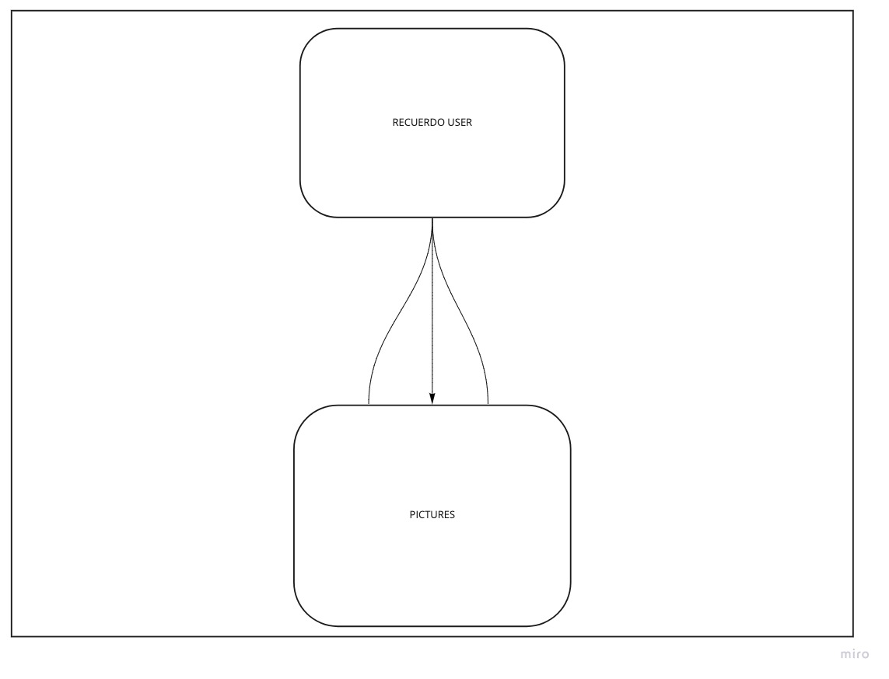

# haiku75.
welcome to haiku75. a place where you can write haikus with a _challenge_. if you're already a fan of the short poetry type - you'll especially love the challenge of only getting 75 total max characters to compose a haiku - and yes, that includes the title too. enjoy 😈.

## Useful Links

- (https://github.com/cesarinag/recuerdo_server "Backend Repo")
- (https://recuerdo-server.herokuapp.com/ "Deployed Backend")
- (https://cesarinag.github.io/recuerdo_client/ "Deployed Client")
- (https://github.com/cesarinag/recuerdo_client "Client Repo")

### Planning Process and Problem-Solving Strategy
If you're here I assume you read the client repo for haiku75. If you haven't, a link can be found above (👆). As I mentioned in the client repo, I love Twitter - but I felt more inclined towards this poetic niche. The real issue was figuring out how many characters were enough characters to still be a challenge but not too much of a challenge that it would annoy users. I changed the amount of max characters many times - in fact, it was originally going to be called haiku51. I settled on a title with a max of _15_ characters; fives with a max of _18_ characters and a seven with a max of _24_ characters.

## Routes
| Verb        | URI Pattern     | Controller # Action  |
| ------------- |:-------------:| -----:|
| POST      | /create-haiku/ | haiku#create |
| GET      | /haikus/      |   haiku#index |
| GET | /haikus/:id/      |    haiku#show |
| PATCH | /haiku/:id/edit/      |    haiku#update |

## User
- email
- hashedPassword
- token

## Haiku
- title
- five syllables
- seven syllables
- five syllables

## User Stories
- Version 1
As a user, I want to sign in
As a user, I want to sign in
as a user, I want to sign out
as a user, I want to change my password
as a user, I want to create a haiku
as a user, I want to view my haikus
as a user, I want to delete haikus I don't like
as a user, I want to update haikus I created

## Unsolved Problems for Future Iterations
- Translate this app to Spanish so my mom can use it
- Create a haiku community and make this more like a forum

## Technologies Used
* Django
* Python
* Heroku
* Shell

## ERD

